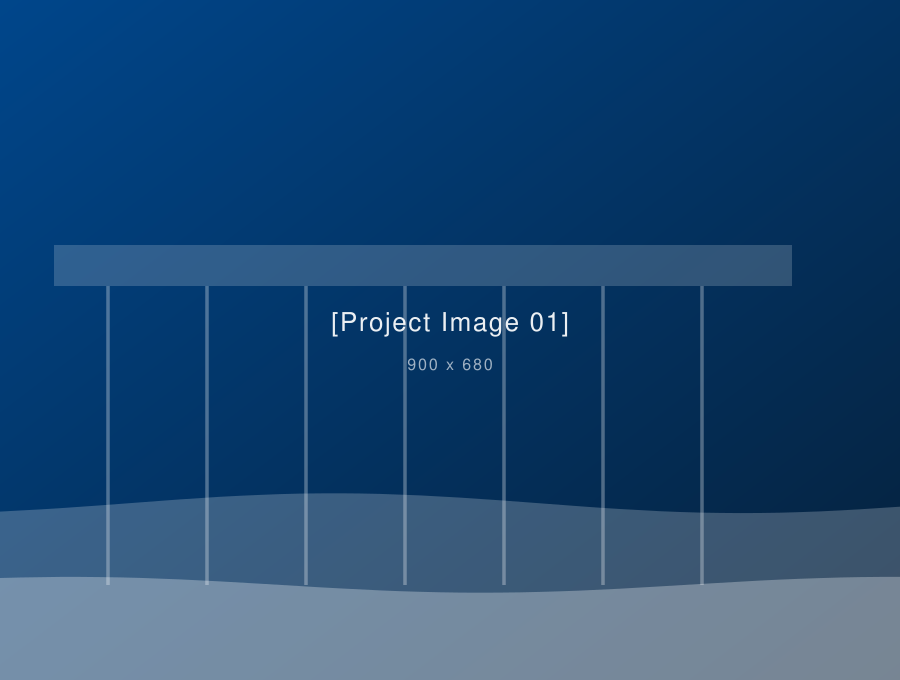

# CMC — Civil, Marine & Coastal Engineering Office

A static corporate website: plain HTML, CSS and vanilla JavaScript. No build step,
no npm install, no server. Upload the folder to GitHub, switch on GitHub Pages and
it is live.

> **Name check:** the uploaded logo reads **CMC** (Civil, Marine & Coastal), while the
> brief was written for "BMC". The site uses **CMC** to match the logo. If BMC is
> correct, do a find-and-replace of `CMC` → `BMC` across the `.html` files, `README.md`,
> `robots.txt` and `sitemap.xml`, and supply a matching logo file.

---

## Contents

```
CMC-Engineering/
├── index.html            Homepage (all 16 sections)
├── about.html            About the office
├── services.html         Six services, each with its own anchor
├── projects.html         Full project grid with filters
├── contact.html          Contact details + enquiry form
├── privacy-policy.html   Template text — needs legal review
├── terms.html            Template text — needs legal review
├── 404.html              Not-found page
├── css/style.css         All styling, driven by CSS variables
├── js/main.js            All interactions
├── assets/images/        Logo, placeholder images, icons
├── favicon.ico
├── robots.txt
├── sitemap.xml
└── .nojekyll             Tells GitHub Pages to serve files as-is
```

---

## 1. Put the files on GitHub

**Without the command line**

1. Create a repository at <https://github.com/new>, for example `CMC-Engineering`, and set it to Public.
2. Open the repository → **Add file → Upload files**.
3. Drag the *contents* of this folder in (so `index.html` sits at the top level of the repository, not inside a sub-folder). Dragging the whole folder also works — GitHub keeps the structure — but then your URL gains an extra path segment.
4. Write a short message and click **Commit changes**.

**With git**

```bash
cd CMC-Engineering
git init
git add .
git commit -m "CMC website"
git branch -M main
git remote add origin https://github.com/USERNAME/CMC-Engineering.git
git push -u origin main
```

## 2. Turn on GitHub Pages

1. Repository → **Settings → Pages**.
2. Under *Build and deployment*, set **Source: Deploy from a branch**.
3. Branch: `main`, folder: `/ (root)`. Save.
4. Wait a minute, then open `https://USERNAME.github.io/CMC-Engineering/`.

Then update these three places with your real address:

- `robots.txt` — the `Sitemap:` line
- `sitemap.xml` — every `<loc>`
- each page's `<link rel="canonical">` and `og:url` in the `<head>`

For a custom domain, add it under Settings → Pages and create a `CNAME` file containing the domain.

**Note on `404.html`:** on a project site (`/CMC-Engineering/`) the 404 page can be served from any path, so its relative links may break on deep URLs. If that matters, change the links inside `404.html` from `index.html` to `/CMC-Engineering/index.html`.

## 3. Replace the logo

Three files in `assets/images/`:

| File | Used in | Notes |
|---|---|---|
| `cmc-logo.png` | Header | Transparent background, dark version |
| `cmc-logo-light.png` | Footer | Pale version for the dark navy footer |
| `favicon.png`, `apple-touch-icon.png`, `favicon.ico` | Browser tab | Square crop of the mark |

Keep the same filenames and no HTML changes are needed. Square or near-square PNG/SVG with a transparent background works best.

## 4. Update company information

Everything that needs your input is wrapped in a placeholder span and shows with a
dashed underline on the page:

```html
<span class="ph">[Company Email]</span>
```

Search each HTML file for `[` to find them all. The recurring ones are:
`[Company Email]`, `[Phone Number]`, `[Office Address]`, `[Office Location]`,
`[Business Hours]`, `[XX]+`, `[CEO Name]`, `[CEO Title]`, `[CEO message]`,
`[Certification Name]`, `[Branch Name]`, `[Branch Address]`.

Two things are easy to miss because they live in attributes, not text:

- `href="mailto:info@example.com"` — the real address goes here too
- `href="tel:+000000000000"` — digits only, with country code
- `data-mailto="info@example.com"` on the contact form

When the placeholder styling is no longer wanted, delete the `.ph` rule in
`css/style.css` (around line 120) and the dashed underlines disappear everywhere.

**Animated statistics.** The stat strip shows `[XX]+` as static text. To animate a
real number, replace the whole element:

```html
<b data-count="18" data-suffix="+">0</b>
```

## 5. Add, edit or remove projects

Project cards live in `index.html` (Featured projects) and `projects.html`.
One card looks like this:

```html
<article class="project" data-category="marine"
         data-meta="Port of Example · Marine · 2024"
         data-detail="Longer description shown in the pop-up.">
  <figure>
    
    <figcaption class="project-tag">Marine</figcaption>
  </figure>
  <div class="project-body">
    <h3>Project name</h3>
    ...
  </div>
</article>
```

- `data-category` must be exactly `civil`, `marine` or `coastal` — that is what the
  filter buttons match on.
- To add a category, copy a filter button in the `.filters` group and give it a new
  `data-filter` value, then use the same value in `data-category`.
- `data-meta` and `data-detail` feed the "View details" pop-up. Delete the
  `data-project-open` link if you do not want a pop-up.
- Deleting a card is safe — nothing else refers to it.

## 6. Replace images and social links

Placeholder graphics are SVG files in `assets/images/`. Drop a real photo in with a
different extension and update the `src`, or overwrite the SVG with a file of the same
name. Suggested sizes:

| Placeholder | Size | Shown as |
|---|---|---|
| `hero.svg` | 1200 × 1000 | 6:5 |
| `about-office.svg` | 1000 × 780 | 5:4 |
| `projects/project-0X.svg` | 900 × 680 | 4:3 |
| `news-0X.svg` | 900 × 560 | 16:10 |
| `ceo-portrait.svg` | 700 × 840 | 5:6 |
| `client-0X.svg` | 260 × 90 | logo slot |
| `cert-0X.svg` | 120 × 120 | badge |

Save photos as JPEG at roughly 1600 px wide and under ~300 KB each. Keep the
`loading="lazy"` attribute on everything below the hero.

Social links are `href="#"` placeholders in the top bar, the footer and the contact
section. Delete the `<li>` for any network you do not use.

**WhatsApp.** The icon links to `https://wa.me/000000000000`. Replace the digits with the
number in international format — country code first, no `+`, no spaces, no dashes. The same
link is used on the buttons in the contact card, and there is one in the top bar, the footer
and the contact section of `index.html` and `contact.html`.

## 7. No forms anywhere

The site takes no input from visitors. There is no contact form, no newsletter signup and
no language switcher — nothing to configure and no third-party service to sign up for.
Enquiries arrive through the email, phone and WhatsApp links instead.

If you later want a form, add one to `contact.html` and point its `action` at a service that
accepts a plain POST (Formspree, Web3Forms, Getform and Basin all do, with free tiers). GitHub
Pages serves static files only, so a form can never post to this site itself. Remember to
update the privacy policy if you start collecting data that way.

## 8. Arabic version

The EN / AR switcher has been removed, so the site is English only. If you want an Arabic
version later:

1. Copy every `.html` file into a new `ar/` folder.
2. In each copy set `<html lang="ar" dir="rtl">` and translate the content.
3. Fix the asset paths (`assets/…` becomes `../assets/…`) or keep a duplicate assets folder.
4. Add a link between the two versions in the header — in `ar/` pages it points back to `../index.html`.

`dir="rtl"` flips the layout automatically because the CSS uses logical properties for
the container and spacing. Check the header and footer afterwards.

## 9. Map and other optional pieces

The map section on `index.html` and the small map on `contact.html` show a placeholder
image. For a real map, open Google Maps, find the location, **Share → Embed a map**, copy
the `<iframe>` and replace the `` inside `.map-frame`:

```html
<div class="map-frame">
  <iframe src="https://www.google.com/maps/embed?pb=..." title="CMC office location"
          loading="lazy" referrerpolicy="no-referrer-when-downgrade"></iframe>
</div>
```

No API key is needed for that embed. Note that it sets third-party cookies — mention it in
the privacy policy.

**Optional sections you can delete outright,** without touching anything else:
`#current-work` (ongoing projects), `#news`, `#map`, `#certifications`, `#ceo`.
Remove the whole `<section>` and, if it appears in the menu, its link.

## 10. Changing the look

All colours, fonts, spacing and radii are CSS variables at the top of `css/style.css`:

```css
--brand: #00468b;        /* sampled from the logo */
--navy-800: #06203a;     /* dark sections */
--mist: #eef3f8;         /* light section background */
--font-display: "Jost", …;   /* headings */
--font-body: "IBM Plex Sans", …;  /* body text */
```

Change a value once and it applies site-wide. Fonts load from Google Fonts via the
`<link>` in each `<head>`; to self-host, put the files in `assets/fonts/` and swap that
link for `@font-face` rules.

---

## Before you publish — checklist

- [ ] Every `[Placeholder]` replaced or its section deleted
- [ ] `mailto:` and `tel:` links updated in the header, footer and contact page
- [ ] Real project cards in, sample cards out
- [ ] Certifications: only those the office genuinely holds
- [ ] Testimonials: only with the client's written permission
- [ ] Privacy policy and terms reviewed by a qualified adviser
- [ ] WhatsApp number set in every `wa.me/` link
- [ ] `USERNAME` replaced in `robots.txt`, `sitemap.xml` and the canonical/`og:url` tags
- [ ] Photos compressed
- [ ] Checked on a phone

## Browser support

Current Chrome, Edge, Firefox and Safari, plus iOS and Android. The project pop-up uses
the native `<dialog>` element; in a browser that lacks it the "View details" link simply
does nothing and the rest of the page is unaffected.
